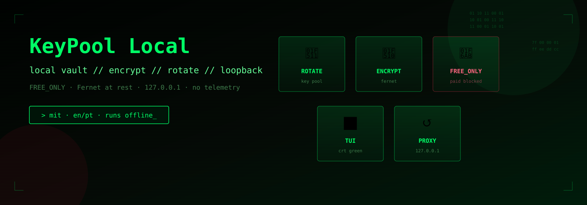
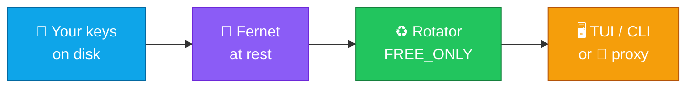
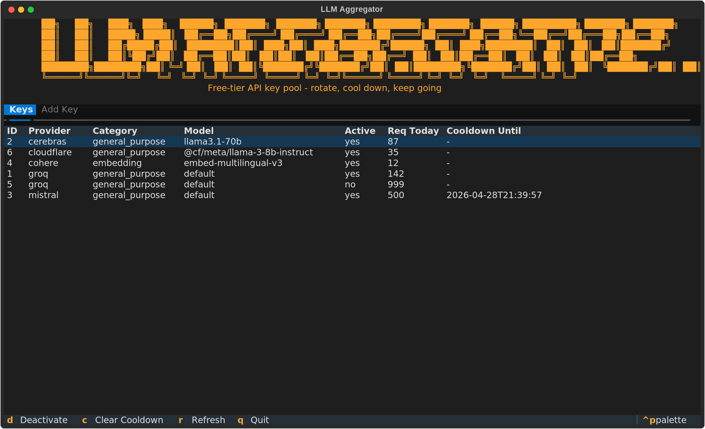
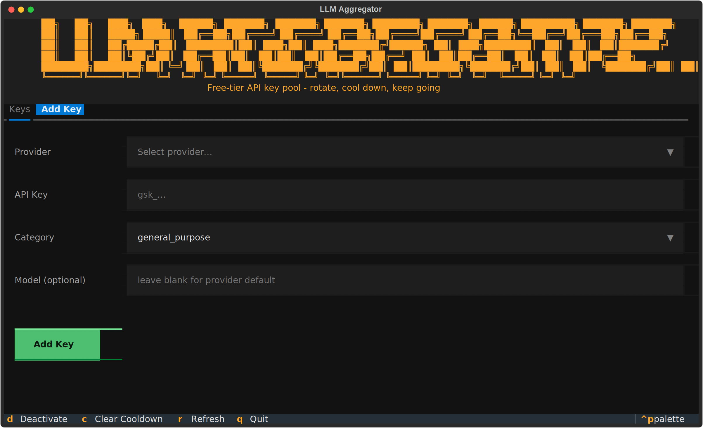
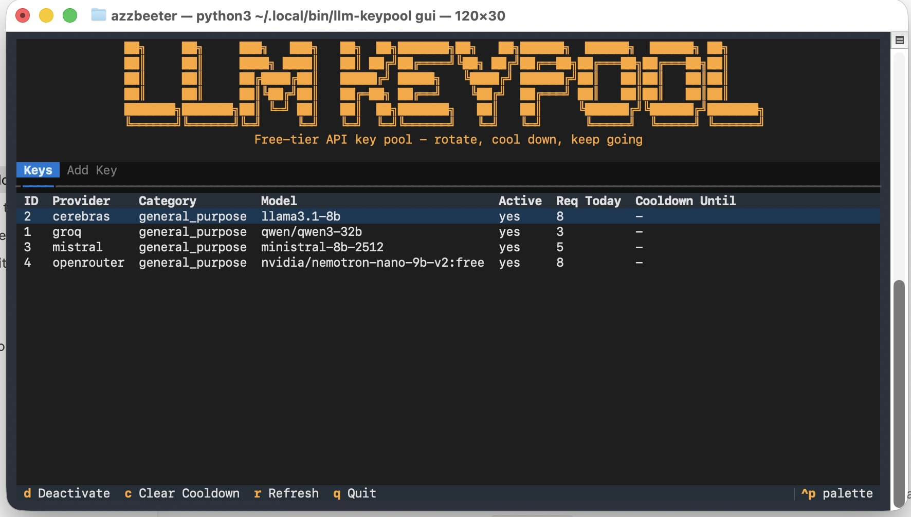

<p align="center">
  
</p>

<p align="center">
  
</p>

<h1 align="center">KeyPool Local</h1>

<p align="center">
  <strong>EN</strong> Local AI API key manager — encrypt, rotate, audit, TUI &amp; loopback proxy<br/>
  <strong>PT</strong> Gestor local de chaves de APIs de IA — encriptar, rodar, auditar, TUI e proxy em loopback
</p>

<p align="center">
  <a href="https://github.com/manansbdb/keypool-local/blob/main/LICENSE"></a>
  
  
  
  
  <a href="https://github.com/manansbdb/keypool-local/actions/workflows/ci.yml"></a>
</p>

<p align="center">
  <a href="./README.pt.md">Português (README.pt.md)</a>
  ·
  <a href="./UPSTREAM.md">UPSTREAM.md</a>
  ·
  <a href="./docs/PROVIDERS.md">Providers</a>
</p>

---

## What it does / Para que serve

| English | Português |
|---------|-----------|
| Keep API keys **on your machine**, encrypted at rest (Fernet). | Mantém chaves de API **na tua máquina**, encriptadas em repouso (Fernet). |
| Rotate across free-tier providers with quotas & cooldown. | Roda entre provedores free-tier com cotas e cooldown. |
| Optional Chat Completions-style proxy bound to **loopback**. | Proxy opcional estilo Chat Completions só em **loopback**. |
| Terminal TUI for keys, status and audit. | TUI no terminal para chaves, estado e auditoria. |



<p align="center">
  
</p>

---

## What this software does NOT do / O que NÃO faz

| EN | PT |
|----|----|
| Does **not** mint credits or unlock subscriptions. | **Não** gera créditos nem “desbloqueia” assinaturas. |
| Does **not** turn paid models into free ones. | **Não** torna modelos pagos automaticamente gratuitos. |
| Does **not** scrape third-party keys or bypass account limits. | **Não** obtém chaves de terceiros nem contorna limites da conta. |

With `FREE_ONLY=true` (default), only catalog routes with verified `free_tier` enter the free pool. Unknown cost stays out.

> Derivative hardening of [piyush-tyagi-13/llm-keypool](https://github.com/piyush-tyagi-13/llm-keypool) (MIT). We are **not** the upstream authors — see `UPSTREAM.md`.

---

## Screenshots / Capturas

<p align="center">
  
  
</p>
<p align="center">
  
</p>

---

## Install / Instalação

### Requirements / Requisitos

- Python **3.11+** (3.12 recommended)
- `pip` + venv

### Clone & install

```bash
git clone https://github.com/manansbdb/keypool-local.git
cd keypool-local
python3.12 -m venv .venv && source .venv/bin/activate
pip install -e ".[all,dev]"
```

Compatibility CLI: `llm-keypool` (Python package `llm_keypool`). Project name on PyPI-style metadata: `keypool-local`.

---

## Quick start / Arranque rápido

```bash
# Master key file (outside Git) — required to encrypt secrets
export LLM_KEYPOOL_MASTER_KEY_FILE="$HOME/.keypool-local/master.key"
mkdir -p "$(dirname "$LLM_KEYPOOL_MASTER_KEY_FILE")"
python -c "from cryptography.fernet import Fernet; open('$LLM_KEYPOOL_MASTER_KEY_FILE','wb').write(Fernet.generate_key())"

# Register a key (hidden prompt — prefer omitting --key)
llm-keypool add --provider groq

# Loopback-only proxy
llm-keypool proxy --host 127.0.0.1 --port 8000

# TUI
llm-keypool gui

# Audit
llm-keypool audit
```

Useful env vars: `LLM_KEYPOOL_DB`, `LLM_KEYPOOL_FREE_ONLY`, `LLM_KEYPOOL_ALLOW_PAID_FALLBACK`, proxy token — see `.env.example`.

---

## Tests / Testes

```bash
pytest -q --ignore=stress_test.py
```

`stress_test.py` is excluded from CI (live calls).

---

## Docs / Documentação

| File | Content |
|------|---------|
| [`UPSTREAM.md`](./UPSTREAM.md) | Upstream SHA + parity matrix |
| [`CHANGELOG.md`](./CHANGELOG.md) | Our changes |
| [`docs/PROVIDERS.md`](./docs/PROVIDERS.md) | Provider status |
| [`README.pt.md`](./README.pt.md) | Extra notes in Portuguese |

---

## Support / Apoio

Optional Bitcoin tip (no subscription, no paywall):

`bc1q0qfnlnxyum9u45stzxe0a7jnhtj4j0usfkqdjw`

---

## License / Licença

MIT — preserves upstream notices plus KeyPool Local contributions.
